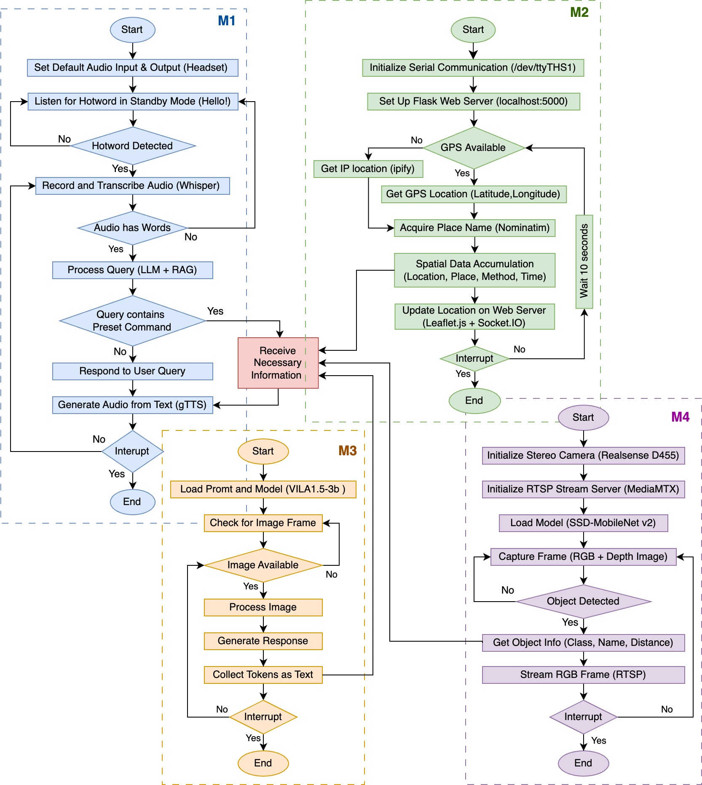

# Resource-Aware Visionary Solution via IoT Edge Computing for Visual Disabilities

An intelligent assistive technology system that leverages IoT edge computing to help individuals with visual disabilities navigate their environment through real-time object detection, location tracking, and natural language interaction.

## 🎯 Project Overview

This project implements a comprehensive AI-powered assistant that combines multiple technologies to provide real-time environmental awareness for visually impaired users. The system operates entirely on edge devices (NVIDIA Jetson) for enhanced privacy and reduced latency.

### Key Features

- **Real-time Object Detection**: Identifies and describes objects in the user's environment
- **Location Tracking**: GPS-based positioning with place name resolution
- **Voice Interaction**: Natural language communication using speech recognition and synthesis
- **Vision-Language Understanding**: Advanced AI models for scene description and analysis
- **MQTT-based Communication**: Distributed system architecture for component coordination
- **Edge Computing**: All processing happens locally for privacy and responsiveness

## 🏗️ System Architecture

The system consists of the following main components:


The architecture integrates the following modules:

- **Assistant**: Central orchestrator for voice interaction and system coordination
- **Object Detection**: Real-time identification of objects using camera input
- **GPS Location**: Provides live location data and place names
- **Vision-Language Model**: Scene understanding and description
- **Video Streaming**: RTSP server for camera feed distribution
- **MQTT Broker**: Facilitates communication between all components

All modules run locally on the NVIDIA Jetson device, ensuring privacy and low latency.

## 🚀 Quick Start

### Prerequisites

- NVIDIA Jetson device (Nano, Xavier, Orin)
- Intel RealSense depth camera
- GPS module
- Python 3.8+
- CUDA-enabled environment

### Installation

1. **Clone the repository**
   ```bash
   git clone https://github.com/akashshingha850/bme_project_2024.git
   cd bme_project_2024
   ```

2. **Install system dependencies**
   ```bash
   sudo apt update
   sudo apt install python3-pip mosquitto mosquitto-clients
   ```

3. **Install Python dependencies**
   ```bash
   pip install -r requirements.txt
   ```

4. **Start MQTT broker**
   ```bash
   sudo systemctl start mosquitto
   sudo systemctl enable mosquitto
   ```

### Running the System

Each component can be started independently using the provided shell scripts:

1. **Start the Assistant (Main component)**
   ```bash
   cd assistant/
   chmod +x assistant.sh
   ./assistant.sh
   ```

2. **Start Object Detection**
   ```bash
   cd object/
   chmod +x object.sh
   ./object.sh
   ```

3. **Start GPS Location Tracking**
   ```bash
   cd gps/
   chmod +x location.sh
   ./location.sh
   ```

4. **Start Vision-Language Model**
   ```bash
   cd vlm/
   chmod +x vision.sh
   ./vision.sh
   ```

5. **Start Video Streaming**
   ```bash
   cd mediamtx/
   chmod +x mediamtx.sh
   ./mediamtx.sh
   ```

## 📁 Project Structure

```
├── assistant/          # Main AI assistant with voice interaction
│   ├── assistant.py    # Core assistant logic
│   ├── assistant.sh    # Startup script
│   └── llama.cpp/      # Local LLM inference
├── object/             # Object detection module
│   ├── object.py       # Real-time object detection
│   └── object.sh       # Object detection startup
├── gps/                # Location tracking
│   ├── location.py     # GPS positioning and place resolution
│   └── location.sh     # GPS service startup
├── vlm/                # Vision-Language Model
│   ├── vision.py       # Scene understanding and description
│   └── vision.sh       # VLM service startup
├── yolo/               # YOLO model benchmarking
│   └── yolo_bench.py   # Performance testing
├── mediamtx/           # Video streaming server
├── stream/             # Video streaming utilities
└── inference/          # Additional inference tools
```

## 🔧 Component Details

### Assistant Module (`assistant/`)
- **Core Component**: Orchestrates all system components
- **Speech Recognition**: Uses Whisper for audio processing
- **Text-to-Speech**: Converts responses to audio output
- **RAG System**: Semantic search for relevant responses
- **MQTT Integration**: Coordinates with all other modules

### Object Detection (`object/`)
- **Real-time Detection**: Uses Jetson Inference for object detection
- **Depth Integration**: Intel RealSense for distance measurement
- **MQTT Triggered**: Activates on voice commands
- **Multiple Models**: Support for SSD-MobileNet and other architectures

### GPS Location (`gps/`)
- **Hardware GPS**: Direct communication with GPS module
- **WiFi Fallback**: Location via IP-based services
- **Place Resolution**: Converts coordinates to readable place names
- **Continuous Tracking**: Real-time location updates

### Vision-Language Model (`vlm/`)
- **Scene Understanding**: Advanced AI for image comprehension
- **Natural Language**: Describes scenes in conversational language
- **Efficient Models**: Optimized for edge deployment (VILA1.5-3b)

### Video Streaming (`mediamtx/`)
- **RTSP Server**: Streams camera feed for processing
- **Low Latency**: Optimized for real-time applications
- **Multi-format Support**: Various streaming protocols

## 🔌 MQTT Topics

The system uses MQTT for inter-component communication:

| Topic | Purpose | Publisher | Subscriber |
|-------|---------|-----------|------------|
| `location/live` | GPS coordinates and place names | GPS Module | Assistant |
| `query/object` | Trigger object detection | Assistant | Object Detection |
| `response/object` | Object detection results | Object Detection | Assistant |
| `query/vlm` | Trigger scene analysis | Assistant | VLM |
| `response/vlm` | Scene descriptions | VLM | Assistant |

## 🎮 Usage

1. **Start the system** using the shell scripts
2. **Say "Hey Tapio"** to activate voice interaction
3. **Ask questions** like:
   - "What objects are around me?"
   - "Where am I located?"
   - "Describe what you see"
   - "Help me navigate"

The system will process your request and provide audio feedback through the speakers.

## 🔧 Configuration

### Model Configuration
- **LLM Model**: Qwen2-0.5B (quantized for efficiency)
- **Object Detection**: SSD-Inception-v2
- **Vision Model**: VILA1.5-3b
- **Speech Recognition**: OpenAI Whisper

### Hardware Configuration
- **Camera**: Intel RealSense D435/D455
- **GPS**: Serial GPS module (115200 baud)
- **Audio**: USB microphone and speakers
- **Processing**: NVIDIA Jetson (any variant)

## 📊 Performance

The system is optimized for real-time performance on edge devices:
- **Object Detection**: ~15-30 FPS (depending on Jetson model)
- **Speech Recognition**: <2 seconds latency
- **Response Generation**: <3 seconds average
- **Memory Usage**: <4GB RAM
- **Power Consumption**: <20W total system

## 🛠️ Development

### Adding New Features
1. Create new component in appropriate directory
2. Implement MQTT communication
3. Add startup script
4. Update README documentation

### Testing
```bash
# Test YOLO performance
cd yolo/
python yolo_bench.py

# Test individual components
python -m pytest tests/
```

### Debugging
- Check MQTT broker: `mosquitto_sub -t "#"`
- Monitor logs: Each component outputs to console
- GPU usage: `nvidia-smi`

## 🤝 Contributing

1. Fork the repository
2. Create a feature branch
3. Make your changes
4. Add tests if applicable
5. Submit a pull request

## 📝 License

This project is part of academic research. Please cite appropriately if used in academic work.

## 📧 Contact

For questions or collaboration:
- **Author**: Akash Shingha Bappy, Tapio Seppänen, and Md Ziaul Hoque
- **Project**: BME Assistive Technology Research
- **Institution**: University of Oulu, Finland


## 🙏 Acknowledgments

- NVIDIA Jetson community for edge AI resources
- OpenAI for Whisper speech recognition
- Ultralytics for YOLO implementations
- Intel RealSense team for depth sensing technology

---

*This project aims to make technology more accessible and improve the quality of life for individuals with visual disabilities through innovative IoT and AI solutions.*